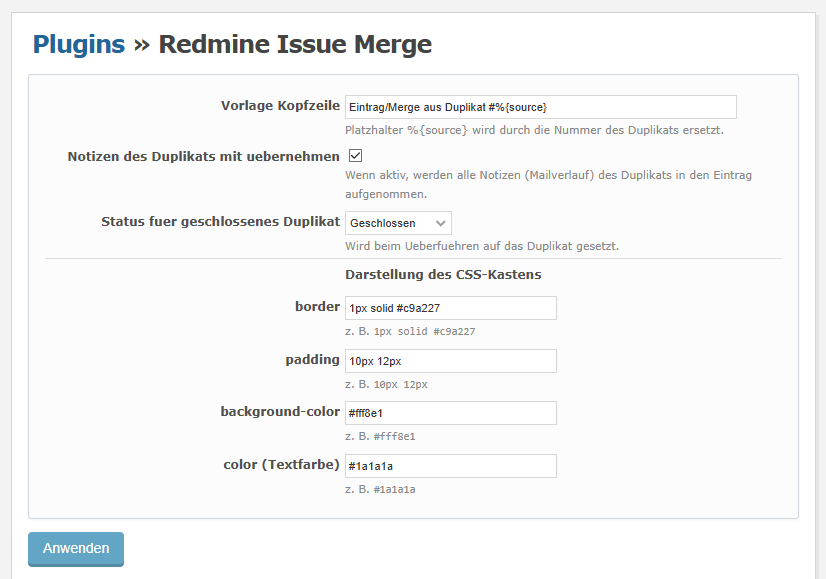
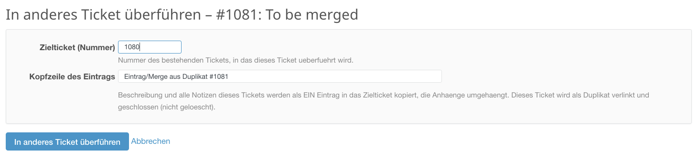

# Redmine Issue Merge

Merge a duplicate issue into an existing one. Built for the dispatch workflow
where an incoming mail without `[#issue-number]` in the subject spawns a second
issue about the same topic. This is also valid for simply duplicated issues.

> German Version: check [README_de.md](README_de.md).

## What it does

When merging a source issue → target issue:

1. **One** journal entry is added to the target issue containing the source
   description and (optionally) all of the source's notes. The first line is a
   freely editable header (default from the settings, e.g.
   `Eintrag/Merge aus Duplikat #123`). The entry is rendered inside a
   configurable CSS box.
2. **Attachments** are moved from the duplicate to the target issue (only the
   database foreign key changes; the files on disk stay untouched).
3. A **"duplicates"** relation is created between the duplicate and the target.
4. The duplicate is **closed** (not deleted) and gets a back-reference note, so
   you can always look it up later.

No schema migration, no manual SQL, no changes to Redmine core files. Only the
regular models are used.

## Installation (Docker volume mount)

`git clone` the `redmine_issue_merge` folder into your redmines `plugins/` folder, 
or download the package into it, then:

```bash
docker compose exec redmine-container-name \
   bundle exec rake redmine:plugins:migrate RAILS_ENV=production
docker compose restart redmine-container-name
```

There is no migration; the migrate task is convention only and does no harm.
The restart is what actually loads the plugin code. No `bundle install` is
required (no extra gems).

## Configuration

After the restart, set up two things:

**1. Permission** under **Administration → Roles and permissions**: grant the
**"Merge issues"** permission to the roles that are allowed to merge. Without
it the action link does not appear.

**2. Plugin settings** under **Administration → Plugins → Configure** (for the
"Redmine Issue Merge" plugin):

<!-- Screenshot of the configuration page -->


| Setting | Meaning |
|---|---|
| **Header template** | Default text of the merge entry's first line. The `%{source}` placeholder is replaced by the duplicate's number. Still editable in the merge form. |
| **Include duplicate's notes** | If enabled, all notes (mail history) of the duplicate are included in the entry. If disabled, only the description is copied. |
| **Status for closed duplicate** | Status applied to the duplicate when merging (only closed statuses are listed). Tip: create a dedicated closed status such as "Duplicate". |
| **border** | CSS border of the box, e.g. `1px solid #c9a227`. |
| **padding** | CSS padding, e.g. `10px 12px`. |
| **background-color** | Background colour, e.g. `#fff8e1`. |
| **color** | Text colour, e.g. `#1a1a1a`. |

## Usage



On the **duplicate's** issue page, open the **"Merge into another issue"** link
in the action bar (`.contextual`, both the top and bottom bars, placed before
the "More" menu). Enter the target issue number, adjust the header if needed,
and submit. The duplicate is closed and its content ends up in the target
issue.

## How the CSS box works

Redmine sanitizes every journal note on display; inline HTML with `style` would
be stripped. The plugin solves this via JavaScript: a small script is injected
into the page head (hook `view_layouts_base_html_head`), finds the note by an
invisible marker (two U+2063 invisible-separator characters around `MERGE`) at
its start, removes the marker and adds the
class `redmine-merge-box` to the note container. The matching CSS
(border/padding/background-color/color from the settings) is emitted from the
same hook. This approach is independent of whichever internal render path
Redmine uses for the note (which changed several times in 6.1).

The action link is likewise injected into every `.contextual` bar via
JavaScript (before `span.drdn`). Its icon uses Redmine's `sprite_icon`
(inline SVG) so it looks like the other action links.

## Notes / limitations

- As of v1.3.0, **edit permission (`edit_issues`) is required on both projects** – the duplicate's and the target's. Private notes of the duplicate are deliberately **not** copied.
- Mail histories are copied verbatim as text (no date sorting, by design).
  Order is chronological by creation time.
- Images referenced inline by filename keep working after the move, because the
  attachments now belong to the target issue.
- The merge runs inside a transaction: if any step fails (e.g. a required field
  on close), nothing is changed.
- Closing the duplicate respects your workflow's required fields. If your
  workflow enforces fields on close, the merge may fail there – relax the
  required fields or pick an appropriate status.
- The box rendering and the contextual link require JavaScript to be enabled.
  The actual merge (data transfer) is entirely server-side.

## Uninstall

Remove the plugin folder and restart Redmine. As there is no migration, no DB
steps are needed. Existing merges remain intact; the invisible marker will
then no longer be removed by JavaScript, but since it consists of invisible
Unicode characters, it does not show up as visible text in the affected note.
